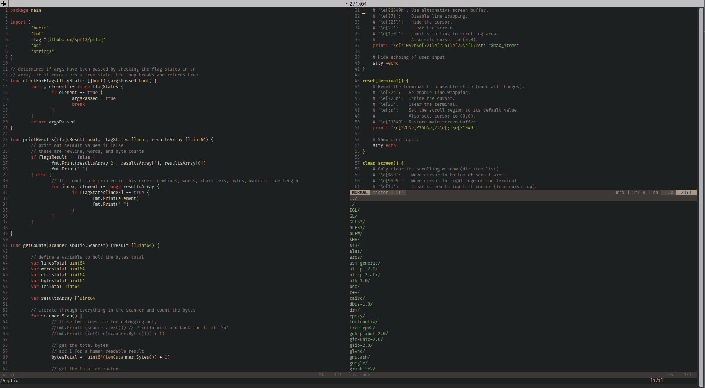
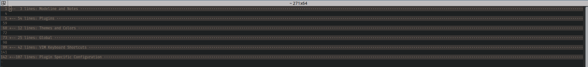

# init.vim
My Neovim configuration


## Requirements
* [Neovim](https://github.com/neovim/neovim/wiki/Installing-Neovim): Latest Stable build preferably
* [vim-plug](https://github.com/junegunn/vim-plug)
* Python 2/3 and pip2/3 if you are doing Python dev
* [ack](https://beyondgrep.com/install/)

## Installation
1. Copy this **init.vim** to ~/.config/nvim/
2. Install the `pynvim` module for python integration using:
```
sudo pip install pynvim && sudo pip3 install pynvim
```
3. Launch Neovim with `sudo` and run `:PlugInstall`
4. Close and relaunch Neovim

## Config Notes
Folding is used to break the config into sections. If the file is not folded when opened, use the default `zM` shortcut to fold all.


## Custom Keyboard Mappings
Keyboard mappings are mostly inspired by Spacemacs.

**Leader Key:** `<SPACE>`

| Shortcut  | Description |
| ------------- | ------------- |
| `<leader>q`  | quit  |
| `<leader>bd`  | close buffer  |
| `<leader>fs` | save buffer |
| `<leader>rr` | refresh all buffers |
| `<leader>fe` | open netrw file browser |
| `<leader>ve` | open vimrc |
| `<leader>vr` | reload vimrc |
| `<leader>w.` | split window horizontal |
| `<leader>w/` | split window vertical |
| `<leader>wd` | close split |
| `<C-k>` | move up a split |
| `<C-j>` | move down a split |
| `<C-h>` | move left a split |
| `<C-l>` | move right a split |
| `<C-up>` | resize +5 |
| `<C-down>` | resize -5 |
| `<C-left>` | vertical resize +5 |
| `<C-right>` | vertical resize -5 |
| `<leader>M` | maximize a split |
| `<leader>m` | minimize a split |
| `<leader>ff` | FZF file search cwd |
| `<leader>fh` | FZF file search ~ |
| `<leader>fw` | FZF file search ~/Dropbox/wiki/ |
| `<leader>bb` | FZF buffer search |
| `<leader>;` | FZF lines search |
| `<leader>o` | FZF btags search |
| `<leader>O` | FZF tags search |
| `<leader>?` | FZF history search |
| `<leader>ss` | search directory with Ack.vim |
| `<leader>cl` | open quickfix window |
| `<leader>jj` | easymotion move to char |
| `<leader>jl` | easymotion move to line |
| `<leader>jw` | easymotion move to word |
| `<leader>gs` | vim-fugitive git status |
| `<leader>gc` | vim-fugitive git commit |
| `<leader>gu` | vim-fugitive git pull |
| `<leader>gp` | vim-fugitive git push |
| `<leader>pp` | markdown preview in web browser |
| `<leader>=` | auto format |

**Terminal Mode**

| Shortcut  | Description |
| ------------- | ------------- |
| `<C-[>`  | exit to normal mode  |
